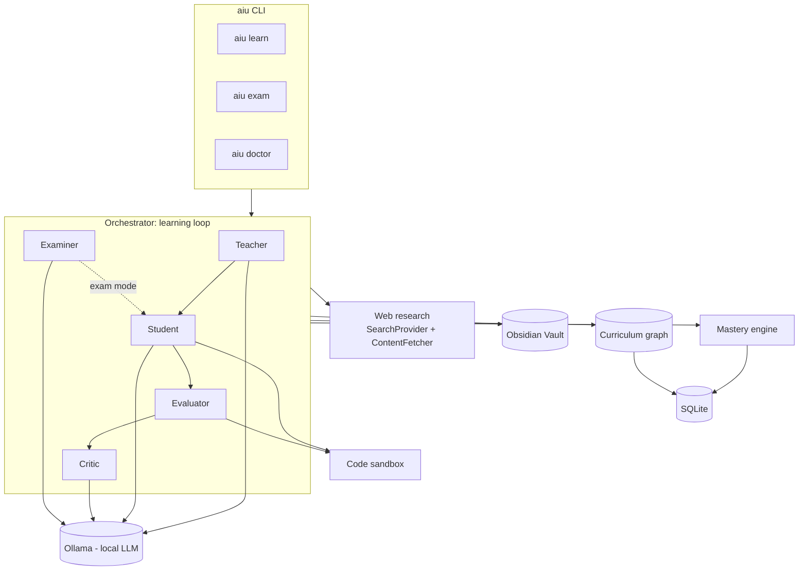

# Local AI University

[](LICENSE)
[](https://github.com/denfry/local-ai-university/actions/workflows/ci.yml)
[](pyproject.toml)

A local-first autonomous learning agent powered by Ollama that studies
computer science, verifies its progress, and builds a visual knowledge
graph in Obsidian.

## Project status

**This repository is currently an architecture scaffold, not a working
agent.** Module boundaries, interfaces, prompts, configuration, and
documentation are in place; the learning-loop implementation itself has
not been written yet. `pip install -e .` will succeed, but the `aiu`
command is not functional until the CLI package (`src/aiu/cli/`) is
implemented. See [docs/development.md](docs/development.md) for the
planned implementation order.

Every module's `__init__.py` documents exactly what it's responsible for
— that's the closest thing to a spec right now.

## What it's meant to do

Local AI University is designed to run a local Ollama model as an agent
that:

- builds and extends a curriculum knowledge graph for **Информатика и
  вычислительная техника** (Computer Science & Computer Engineering);
- picks the next topic to study based on weak prerequisites, not a fixed
  syllabus order;
- finds and ranks trustworthy sources on the open web;
- turns them into structured lessons;
- solves practice problems and writes/runs real code to check its work;
- gets objectively graded — never by asking the LLM if it's right;
- tracks recurring mistakes across topics;
- computes mastery from evidence, with confidence that stays low until
  there's enough evidence to justify otherwise;
- writes everything into an Obsidian vault as linked Markdown notes, so
  progress is visible as a real knowledge graph in Obsidian's Graph View.

## Architecture



See [docs/architecture.md](docs/architecture.md) for the full component
breakdown and the learning-loop sequence.

## Requirements (once implemented)

- Python 3.12+
- [Ollama](https://ollama.com) running locally, with at least one model
  pulled (e.g. `ollama pull qwen2.5:7b`)
- An [Obsidian](https://obsidian.md) vault (any folder Obsidian can open)
- Git

## Quick start (planned)

```bash
git clone https://github.com/denfry/local-ai-university.git
cd local-ai-university
pip install -e ".[dev]"

cp .env.example .env
cp config.example.toml config.toml
# edit .env / config.toml: OLLAMA_MODEL, OBSIDIAN_VAULT_PATH, etc.

aiu doctor      # checks Ollama, the model, the vault, the DB, sandbox
aiu learn       # runs one learning session
aiu exam "Binary Search"
aiu sync-obsidian
```

Until the CLI is implemented, `aiu doctor`/`aiu learn`/etc. will not run
— use `docs/development.md` if you want to help build them.

## CLI commands (target surface)

| Command | Purpose |
|---|---|
| `aiu init` | Scaffold config files and workspace directories |
| `aiu doctor` | Check Ollama, model, vault, DB, sandbox availability |
| `aiu status` | Model, progress, current/weakest topics, recent sessions |
| `aiu curriculum` | Show the curriculum knowledge graph |
| `aiu learn [--topic X] [--iterations N]` | Run a learning session |
| `aiu exam <topic>` | Run an isolated exam (no hints, no memory, no web) |
| `aiu sync-obsidian` | Regenerate the Obsidian vault from the database |
| `aiu sources <topic>` | Show sources used for a topic |
| `aiu mistakes` | Show recurring mistakes across skills |
| `aiu demo` | Offline demo using a fake LLM provider, no Ollama needed |

## Curriculum

Seeded top-level domains: Математическая база, Программирование,
Архитектура вычислительных систем, Операционные системы, Компьютерные
сети, Базы данных, Теория вычислений, Software Engineering, Продвинутые
темы. Full breakdown in [docs/curriculum.md](docs/curriculum.md).

## How mastery works

Mastery is computed by the system from test/exam evidence — never
self-reported by the LLM. A single solved problem cannot produce high
mastery. Details, including the understanding/implementation/debugging/
explanation/transfer sub-scores, in [docs/mastery.md](docs/mastery.md).

## How internet research works

A `SearchProvider` + `ContentFetcher` abstraction, source trust/relevance
scoring, and a strict priority order (official docs and standards first).
Details in [docs/web-research.md](docs/web-research.md).

## Security

- **Prompt injection**: all fetched web content is treated as untrusted
  data, never as instructions. See
  [docs/security.md](docs/security.md#prompt-injection-and-untrusted-sources).
- **Sandbox warning**: the default subprocess code sandbox is meant to
  catch bugs in the agent's own generated code, timeout runaway loops,
  and keep secrets/host filesystem out of reach — it is **not** a
  security boundary suitable for running arbitrary hostile code. See
  [docs/security.md](docs/security.md#code-execution-sandbox).
- Vulnerability reporting: [SECURITY.md](SECURITY.md).

## Data model

SQLite tables: `skills`, `prerequisites`, `learning_sessions`,
`problems`, `attempts`, `evaluations`, `mistakes`, `sources`, `notes`,
`mastery_history`. See [docs/architecture.md](docs/architecture.md).

## Roadmap

**v0.1** — Ollama provider, SQLite, curriculum graph, learning loop,
pytest/SymPy evaluation, Obsidian sync, web research.

**v0.2** — spaced repetition, stronger adaptive testing, Docker sandbox,
property-based testing, embeddings/RAG.

**v0.3** — Lean 4 integration, multi-model evaluation, benchmark suites,
knowledge graph analytics.

**Future research** — controlled self-generated training datasets,
fine-tuning experiments, candidate model benchmarking, regression gates.
None of this is implemented and fine-tuning is explicitly out of scope
for now — this project does not modify model weights.

## Contributing

See [CONTRIBUTING.md](CONTRIBUTING.md) and
[docs/development.md](docs/development.md). Please also read
[CODE_OF_CONDUCT.md](CODE_OF_CONDUCT.md).

## License

[MIT](LICENSE)
