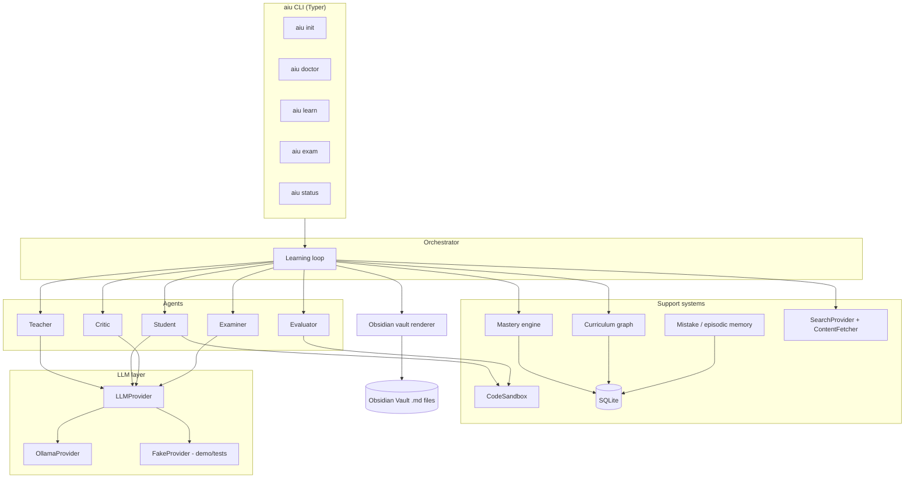

# Architecture

> Status: this document describes the target architecture for the MVP.
> As of this writing the repository contains the module scaffold and
> documentation described here, not the implementation. See the
> "Project status" section of the root README for what actually runs
> today.

## Goals that shape the design

- **Local-first.** The reasoning engine is a local Ollama model. No
  commercial cloud LLM API is required for the system to function.
- **Objective evaluation over self-report.** An LLM never gets to decide
  that it has mastered something; mastery is computed from pytest/SymPy
  results, hidden tests, and exam performance.
- **Untrusted web content.** Anything fetched from the internet is data
  to be read, summarized, and cited — never a source of instructions to
  the agent. See [security.md](security.md).
- **Obsidian as the interface.** The knowledge graph is not a database
  abstraction the user has to query; it's a folder of Markdown files
  with wikilinks that Obsidian's built-in Graph View can render as-is.

## Component map



## Module layout

```
src/aiu/
├── cli/         CLI commands (Typer app, one module per command group)
├── config/      Config + .env loading, safety-limit defaults
├── llm/         LLMProvider interface, OllamaProvider, FakeProvider
├── agents/      orchestrator, student, teacher, critic, examiner, evaluator
├── curriculum/  Skill graph model + topic-selection logic
├── mastery/     Objective mastery scoring engine
├── memory/      Mistake tracking, episodic/semantic/procedural memory
├── web/         SearchProvider, ContentFetcher, source scoring
├── sandbox/     CodeSandbox (subprocess default, optional Docker)
├── obsidian/    Vault renderer (notes, dashboard, learning log)
└── db/          SQLite models/repositories (SQLModel)
```

Each package's `__init__.py` documents its intended responsibilities in
detail; that is the closest thing to a spec for implementers right now.

## The learning loop (target behavior)

1. Load the curriculum graph and orchestrator state from SQLite.
2. Identify weak prerequisites for the current goal domain.
3. Select the next topic (curriculum module, informed by mastery data).
4. Search + fetch + score candidate sources for that topic.
5. Teacher turns accepted sources into a lesson.
6. Student studies the lesson, then attempts practice problems.
7. Evaluator objectively checks each attempt (tests, SymPy, numeric
   checks — never "ask the LLM if it's right").
8. Critic analyzes failures and proposes remediation; mistakes are
   recorded and checked against existing mistake categories.
9. A short remediation + re-test cycle runs for failed attempts.
10. The mastery engine recomputes mastery/confidence per skill from
    accumulated evidence.
11. Everything (session, problems, attempts, evaluations, mistakes,
    mastery history) is persisted to SQLite.
12. The Obsidian vault is regenerated/updated to reflect the new state.
13. The orchestrator picks the next step, subject to iteration/budget
    limits, and can resume safely if interrupted (Ctrl+C or restart).

Exam mode (`aiu exam <topic>`) runs a reduced version of this loop with
Teacher, web access, hints, and episodic memory all disabled — see
[mastery.md](mastery.md) for why that isolation matters.

## Why not a big agent framework

The roles above (Orchestrator/Student/Teacher/Critic/Examiner/Evaluator)
are plain Python classes coordinated by the Orchestrator, not agents
running inside a heavyweight framework. For a small number of
well-defined roles with a mostly linear control flow, an explicit loop is
easier to reason about, test, and keep safe (see
[security.md](security.md)) than a general-purpose agent framework would
be for this MVP's scope.
